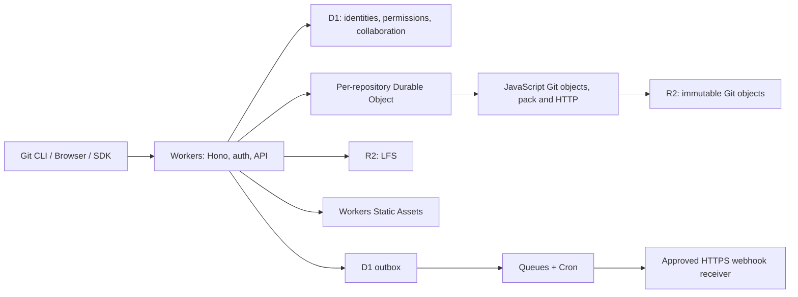

# OneStorage architecture — v0.2

OneStorage independently implements a small Git forge inspired by [code.storage](https://code.storage/). It does not contain code.storage or GitLab source, assets or proprietary internals, and does not claim their scale or feature parity.

## Runtime

Git code executes within the repository Durable Object on Workers. There is no container, filesystem, shell, subprocess, Git executable or separate engine port. Web Crypto computes SHA-1; pinned pako 2.2.0 performs zlib compression/decompression in JavaScript. No WASM module is required. Local development runs the same engine in workerd; native Git is only an independent test client and compatibility oracle.

## Objects and packfiles

`src/git/objects.ts` implements canonical `type size\0payload` objects, SHA-1 IDs, binary trees, commit/tag parsing, graph traversal and repository-scoped R2 access. Gitlinks are preserved as external submodule commit references; their objects are not required in the containing repository. Filenames must be UTF-8. Symlinks and executable bits are preserved; symlinks are never followed by the service.

R2 key `repos/<repository UUID>/objects/<40-hex oid>` contains **uncompressed canonical object bytes**, not a native Git loose object's zlib bytes. Reads verify size and SHA-1. Writes use conditional create, never overwrite; existing bytes must match. Cross-repository deduplication is intentionally absent.

`src/git/pack.ts` parses PACK v2/v3, checks the SHA-1 trailer, sizes, zlib checksums/member boundaries and delta instruction bounds. It handles OFS_DELTA, REF_DELTA, forward delta bases and thin packs with bases from R2. Expansion and chain depth are bounded. Pack output uses independently compressed complete objects; it is valid Git but less compact than native Git delta output.

`src/git/protocol.ts` implements stateless smart HTTP. Upload supports protocol v0 and v2 (`ls-refs`, `fetch`, sideband, include-tag). Negotiation uses NAK until the client sends done; it does not advertise multi-ACK. Receive-pack implements report-status, delete-refs and atomic updates. It accepts Git's flush-only authentication probe. Requests for objects not reachable from current repository refs are denied. Shallow/filter/SHA-256 negotiation is unsupported.

## Ref transaction and failure boundaries

1. The outer Worker authenticates and checks project role. Repository UUIDs and default branches come from trusted D1 metadata.
2. Requests route to a DO named by that UUID. A promise queue serializes both reads and writes, with a limit of 16 in-flight/queued requests.
3. Each operation loads the complete `refs.v2` dictionary from DO SQLite storage and creates a request-local R2 object cache/staging area.
4. A push validates all expected old SHAs, ref names, target types, graph connectivity and fast-forward policy. A failure rejects the entire batch, including when the client did not request atomic mode.
5. Write all staged immutable objects to R2 and await completion.
6. Publish the complete new ref dictionary with **one awaited DO storage put**, then acknowledge success. Ref publication is atomic across branches/tags in that push.

Failure before step 6 leaves refs unchanged, possibly with unreachable R2 objects. Failure after durable ref publication but before the client receives the response is ambiguous to the client: inspect refs before retrying. No correctness depends on memory surviving a Worker restart. A missing committed object fails closed; the service does not silently create an empty replacement repository.

R2 objects and DO refs are separate services. Ordering avoids publishing missing uploads but is not a cross-service transaction. No automatic garbage collection exists. Never apply an R2 lifecycle policy that can delete reachable objects.

## Collaboration

API file commits require `expected_sha` (null for an absent branch). A stale edit returns 409. Branches must point to commits, non-fast-forward pushes and tag rewrites are rejected, and default-branch deletion is forbidden. Other branch/tag deletions are supported. The browser currently lists branches, not a full tag management UI.

Merge requests capture immutable source and target SHAs; merge rechecks both and permits only fast-forward. A retry may finalize D1 state after Git succeeded. There is no rebase/squash or conflict editor. Diffs are complete file replacement hunks, including mode/binary information, with a 2 MiB cap.

D1 metadata/audit/outbox and DO refs are **not one distributed transaction**. Git can commit while a subsequent D1 write fails. Webhook events cannot be the only ledger for replication; reconcile refs independently.

## Identity and egress

Private repositories require owner or membership, including for instance administrators. Owner/maintainer manage settings and merging; developers write; readers fetch and discuss issues. Public reads are anonymous; writes always require credentials.

Opaque 256-bit PATs are stored as SHA-256 hashes, with read/write scopes and expiry. Git accepts PATs, not account passwords. Browser sessions use HttpOnly, SameSite=Strict cookies, Secure on HTTPS, with seven-day expiry. Cookie-authenticated mutations enforce APP_ORIGIN. Password changes revoke all credentials. PBKDF2-SHA256 uses 100,000 iterations; there is no MFA/SSO. Login permits 20 attempts per IP per ten-minute bucket.

LFS basic transfer stores repository-isolated SHA-256 objects with a 16 MiB cap. Webhooks require an operator-managed HTTPS hostname allowlist, no redirects and a ten-second timeout. Events use timestamped HMAC, a D1 outbox, Queues and a five-minute Cron replay. Delivery is at least once, capped at five HTTP attempts; receivers deduplicate by delivery ID. Default egress allowlist is empty.

## v0.1 upgrade

If `refs.v2` is absent and the old DO `snapshot` pointer exists, `src/git/legacy.ts` imports that tar entirely in JavaScript. It checks archive headers, imports loose and packed objects, ignores AppleDouble metadata generated by macOS, validates refs/connectivity, then publishes `refs.v2`. It preserves every imported Git SHA. The old snapshot pointer/archive remains untouched for manual rollback/backup; it is no longer updated after migration. An old engine rollback would therefore miss later v0.2 writes.

Migration is limited to a 24 MiB old archive and the new engine's object/graph budgets. Test a copy before upgrading repositories near those limits. Keep DO class name and repository UUID mapping unchanged. This deployment had no previously published Container class; an operator upgrading an independently deployed old production configuration must preserve its migration history and explicitly retire that old class.

## Resource limits and future work

See the README limits table. In addition to application budgets, Workers/DO CPU, memory and subrequest limits apply. Requests keep decoded and compressed data in memory; the 32 MiB budget is not a guarantee that all operations fit the runtime heap. Fetch walks all refs to authorize wants, which bounds practical history size and increases R2 latency. No production-scale benchmark or SLA is claimed.

Next substantial work: bounded streaming pack processing, delta-compressed output, indexed reachability and batched reads, quotas, reliable GC/backup tooling, SHA1 collision-detection hardening, richer diff/merge UX, organizations, SSH gateway and isolated CI execution. Repository code must never execute inside the Git service.

Protocol references: [Git pack format](https://git-scm.com/docs/gitformat-pack), [pack protocol](https://git-scm.com/docs/gitprotocol-pack), [HTTP protocol](https://git-scm.com/docs/gitprotocol-http), [protocol v2](https://git-scm.com/docs/gitprotocol-v2), [Workers limits](https://developers.cloudflare.com/workers/platform/limits/).
